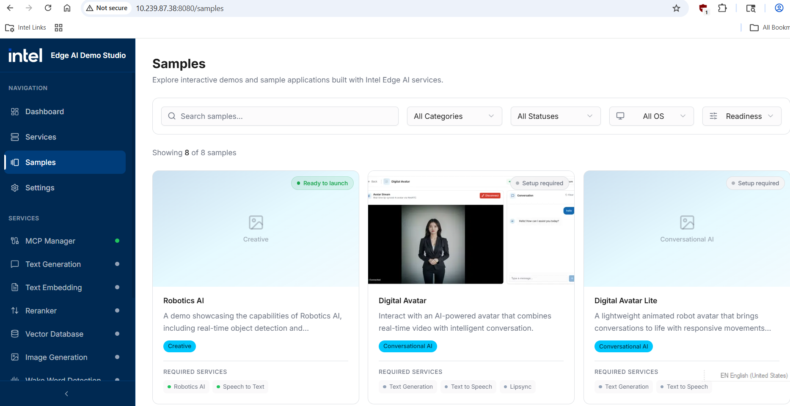
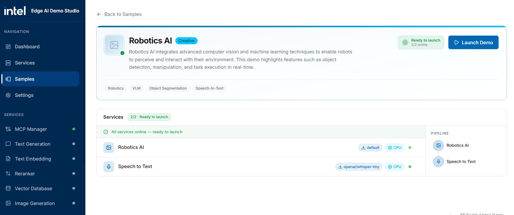
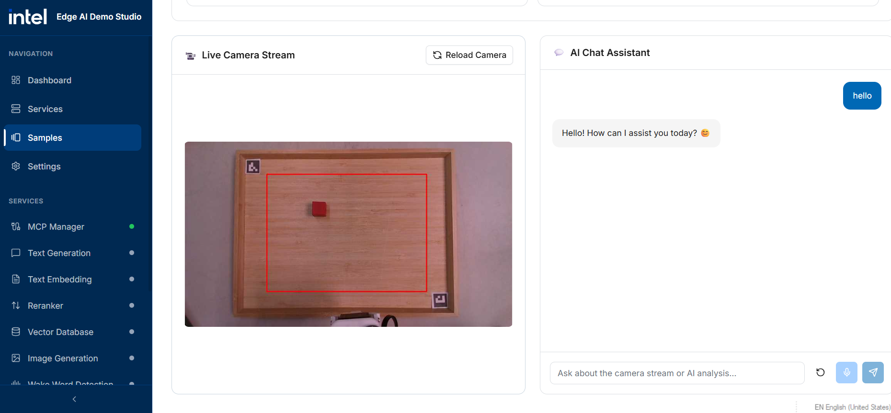
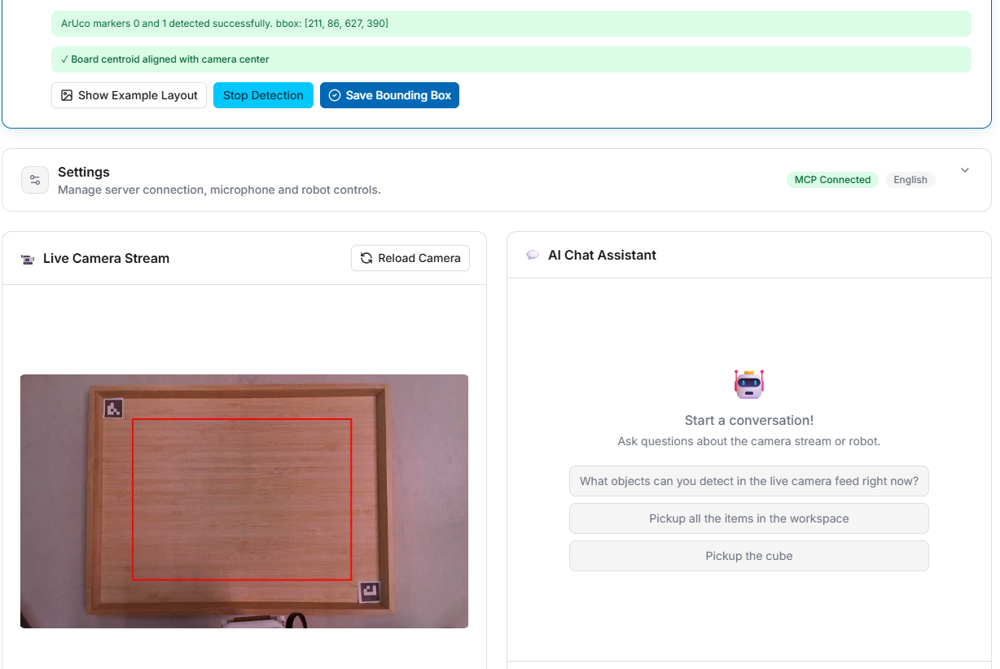
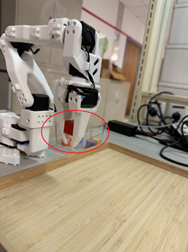
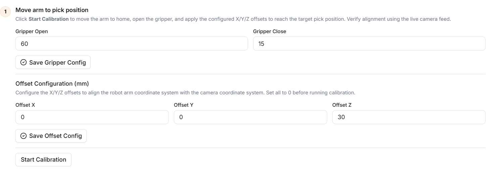
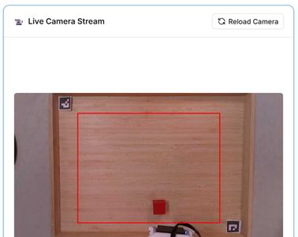
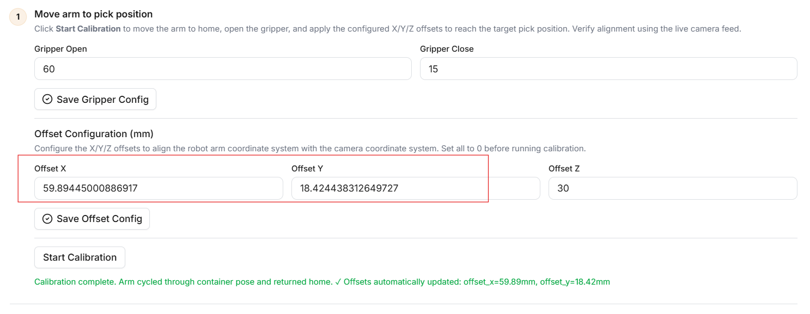
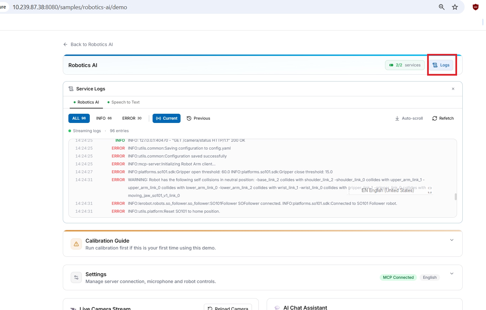

# Robotics AI Setup

## Setup Instructions

### Prerequisites

- Ubuntu 24.04.4 or later with Docker installed
- RealSense camera working properly (verify with `realsense-viewer` tool)
- LeRobot controller detected at `/dev/ttyACM0` (verify with the command below)

```bash
$ ls /dev/ttyACM0
```

### 1. Pull Docker image

```bash
$ docker pull chenhaochuan82/robotic-ai:latest
```

### 2. Launch the container

```bash
$ git clone https://github.com/haochuan1982/edge-developer-kit-reference-scripts-patch.git
$ cd edge-developer-kit-reference-scripts-patch
$ export ROBOT_AI_DIR=/opt/edge-developer-kit-reference-scripts/usecases/ai/edge-ai-demo-studio/workers/robotics-ai

$ docker run -it --rm \
  --device /dev/dri/card1 \
  --device /dev/dri/renderD128 \
  --device /dev/video0 \
  --device /dev/video1 \
  --device /dev/video2 \
  --device /dev/video3 \
  --device /dev/video4 \
  --device /dev/video5 \
  --device /dev/accel/accel0 \
  --device /dev/ttyACM0 \
  --group-add video \
  --group-add render \
  --group-add plugdev \
  -v $PWD/calibration:/root/.cache/huggingface/lerobot/calibration \
  -v $PWD/config.yaml:$ROBOT_AI_DIR/config.yaml \
  -p 8080:8080 \
  chenhaochuan82/robotic-ai:latest \
  bash -c "start.sh"
```

### 3. Open your browser

Navigate to http://localhost:8080 to access the dashboard.



### 4. Start the Robotics AI sample

Once the dashboard loads, navigate to the "Samples" section in the sidebar and select "Robotics AI". Click the "Start Required" button to initialize and launch the robotics AI application. Wait for the service to start up, then click the "Launch Demo" button to open the robotics AI demo interface.



### 5. Configure and test the robot

In the Robotics AI interface, select robot type "SO-ARM101" from the robot selection dropdown. Click the "Reload Camera" button to initialize the camera feed. To verify that everything is working correctly, test the AI Chat Assistant by saying "Hello" and confirm you receive a response.



### 6. Calibrate the robot (First-time setup only)

For first-time setup, you need to calibrate the LeRobot arm. Follow these steps:

1. Navigate to the "Calibrate Guide" section in the interface.
2. Click "Start Motor Calibrate".
3. Select "Run new calibration".
4. Follow the [calibration video](https://huggingface.co/docs/lerobot/so101?example=Linux&assembly=Follower#calibrate) instructions to complete the arm calibration process.
5. After calibration is complete, a JSON configuration file will be generated at:
```bash
 <your work path>/edge-developer-kit-reference-scripts-patch/calibration/robots/so_follower/SO101Follower.json
```

### 7. Calibrate the camera

After completing the arm calibration, proceed with camera calibration. Click the "Start Detection" button and ensure that the plate and red block are both positioned in the center of the camera preview window.



### 8. Calibrate home position offset

Before the arm can complete pick and place tasks, you need to calibrate the arm's "Home" position offset relative to the camera base point.

1. Place a brick in the gripper.



2. Set x, y offset to 0 and click "Save Offset Config".



3. The brick will be placed in the home position. Ensure the home position is inside the red block.



4. After clicking "Confirmation", the home position's offset x, y will be calculated.



5. Fine-tune the offset x, y, z values through pick and place testing.

### 9. Control the robot with AI Chat Assistant

Now you're ready to control the robot! Use the AI Chat Assistant to command the robot arm. For example, ask it to pick up the object on the plate inside the red block. Simply type or speak your command, and the robot will execute the task.

## Tips

### Check logs for troubleshooting

During deployment, if any issues occur, you can check the printed logs.



### If you receive the Docker image via file sharing, concatenate it with this command

```bash
$ cat robotic-ai-20260529.tar.0* > robotic-ai-20260529.tar
$ docker load -i robotic-ai-20260529.tar
```

### If you want to build the Docker image

```bash
$ git clone https://github.com/haochuan1982/edge-developer-kit-reference-scripts-patch.git
$ cd edge-developer-kit-reference-scripts-patch
$ git submodule update --init edge-developer-kit-reference-scripts
$ cd edge-developer-kit-reference-scripts
$ git am ../patch/*.patch
$ cd ..
$ docker build -t robotic-ai .
```
